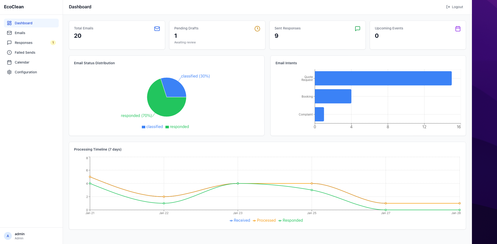
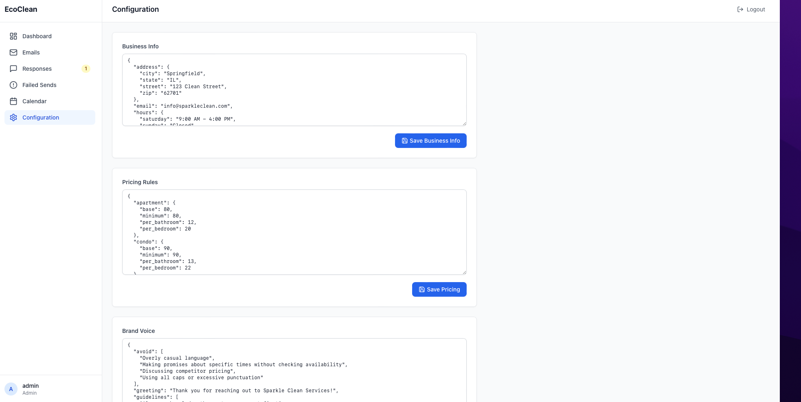
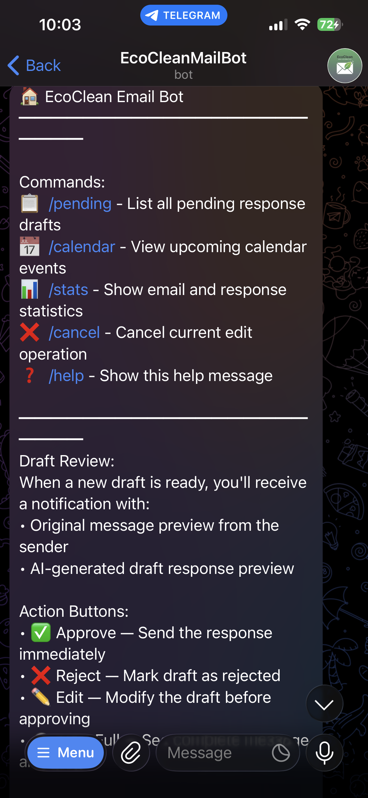
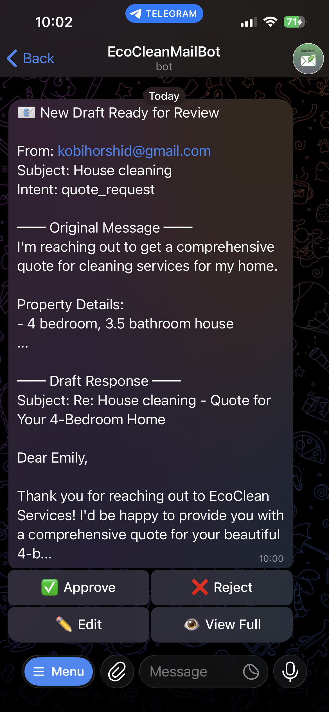
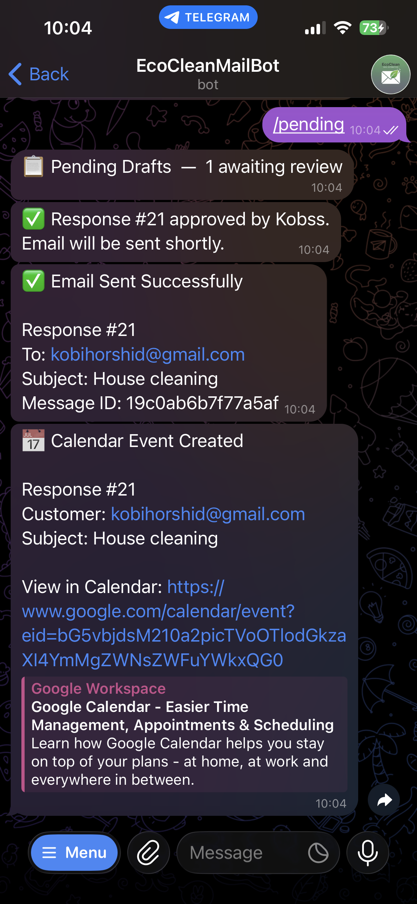

# AI Email Automation Platform

**An end-to-end AI-powered email automation platform demonstrating production-grade microservices architecture, distributed task processing, and LLM integration.**

This project showcases the design and implementation of a complete business automation system — from ingesting raw customer emails to generating AI-driven responses, managing human approval workflows, and synchronizing with external services. Built to solve a real-world problem for service businesses: eliminating manual email triage while maintaining quality control through a human-in-the-loop pattern.

**Core Engineering Highlights:**
- **Distributed Architecture** — 7 containerized microservices communicating via Redis Pub/Sub and Celery task queues
- **AI/NLP Pipeline** — Claude API integration for intent classification, entity extraction, and context-aware response generation
- **Full-Stack Implementation** — React + TypeScript SPA with Flask REST API, JWT authentication, and role-based access control
- **Real-Time Admin Interface** — Telegram Bot with inline keyboard callbacks, conversational workflows, and instant push notifications
- **Multi-Service Integration** — Gmail API (OAuth 2.0), Google Calendar API (bidirectional sync), Telegram Bot API
- **Production-Ready Infrastructure** — Docker Compose orchestration, connection pooling, rate limiting, retry logic, and comprehensive error handling

Built with **Python**, **Flask**, **React/TypeScript**, **PostgreSQL**, **Redis**, **Celery**, and **Docker**.

## Screenshots

<details>
<summary><strong>Web Dashboard</strong> — Analytics & email management interface</summary>
<br>


</details>

<details>
<summary><strong>Telegram Bot</strong> — Real-time approval workflow with inline actions</summary>
<br>



</details>

<!-- <details>
<summary><strong>Calendar Integration</strong> — Conflict detection and scheduling</summary>
<br>

</details> -->

## Table of Contents

- [Overview](#overview)
- [Key Capabilities](#key-capabilities)
- [Tech Stack](#tech-stack)
- [Architecture](#architecture)
- [Prerequisites](#prerequisites)
- [Quick Start](#quick-start)
  - [Gmail API Setup](#6-gmail-api-setup)
  - [Telegram Bot Setup](#7-telegram-bot-setup)
- [Google Calendar Integration](#google-calendar-integration)
- [Web Dashboard](#web-dashboard)
- [API Reference](#api-reference)
- [Project Structure](#project-structure)
- [Database Schema](#database-schema)
- [Configuration](#configuration)
- [Running Migrations](#running-migrations)
- [Testing](#testing)
- [Proof of Concept](#proof-of-concept)
- [Development](#development)
- [Completed Milestones](#completed-milestones)

## Overview

This system demonstrates how to architect an **event-driven, asynchronous processing pipeline** that handles real-world complexity: unreliable external APIs, variable processing times, and the need for human oversight in AI-generated content.

The core design pattern is **human-in-the-loop automation** — the system handles all the tedious work (email parsing, intent classification, entity extraction, response drafting, scheduling) while routing every AI-generated response through an approval workflow before customer delivery. This pattern balances automation efficiency with quality control, a critical consideration when deploying LLMs in customer-facing contexts.

### System Pipeline

```
┌──────────────────────────────────────────────────────────────────────────────────┐
│                           EXTERNAL SERVICES LAYER                                │
│  ┌──────────┐   ┌──────────┐   ┌──────────────┐   ┌────────────────────────┐    │
│  │  Gmail   │   │  Claude  │   │   Telegram   │   │    Google Calendar     │    │
│  │   API    │   │   API    │   │   Bot API    │   │         API            │    │
│  └────┬─────┘   └────┬─────┘   └──────┬───────┘   └───────────┬────────────┘    │
├───────┼──────────────┼────────────────┼───────────────────────┼─────────────────┤
│       │              │                │                       │                  │
│       ▼              ▼                ▼                       ▼                  │
│  ┌─────────────────────────────────────────────────────────────────────────┐    │
│  │                      CELERY ASYNC TASK LAYER                            │    │
│  │  ┌─────────────┐  ┌─────────────┐  ┌─────────────┐  ┌─────────────┐    │    │
│  │  │ FETCH QUEUE │  │PROCESS QUEUE│  │ SEND QUEUE  │  │CALENDAR QUEUE│   │    │
│  │  │             │  │             │  │             │  │              │   │    │
│  │  │ • Poll Gmail│  │ • Classify  │  │ • Dispatch  │  │ • Create     │   │    │
│  │  │ • Parse MIME│  │ • Extract   │  │ • Retry     │  │ • Sync       │   │    │
│  │  │ • Dedup     │  │ • Generate  │  │ • Thread    │  │ • Conflicts  │   │    │
│  │  └──────┬──────┘  └──────┬──────┘  └──────┬──────┘  └──────┬───────┘   │    │
│  │         │                │                │                │           │    │
│  │         └────────────────┴────────┬───────┴────────────────┘           │    │
│  │                                   │                                     │    │
│  │                          ┌────────▼────────┐                           │    │
│  │                          │  REDIS BROKER   │                           │    │
│  │                          │  • Task Queue   │                           │    │
│  │                          │  • Pub/Sub      │                           │    │
│  │                          │  • Rate Limits  │                           │    │
│  │                          └────────┬────────┘                           │    │
│  └───────────────────────────────────┼─────────────────────────────────────┘    │
│                                      │                                          │
├──────────────────────────────────────┼──────────────────────────────────────────┤
│                    APPROVAL WORKFLOW │ (Human-in-the-Loop)                      │
│           ┌──────────────────────────┴──────────────────────────┐               │
│           │                                                      │               │
│    ┌──────▼──────┐                                      ┌───────▼───────┐       │
│    │ TELEGRAM BOT │                                      │ WEB DASHBOARD │       │
│    │              │                                      │               │       │
│    │ • Push Notif │                                      │ • React SPA   │       │
│    │ • Inline KB  │◄────────── APPROVE ─────────────────►│ • JWT Auth    │       │
│    │ • /pending   │◄────────── REJECT ──────────────────►│ • Role-based  │       │
│    │ • /calendar  │◄────────── EDIT ────────────────────►│ • Analytics   │       │
│    └──────────────┘                                      └───────────────┘       │
│                                                                                  │
├──────────────────────────────────────────────────────────────────────────────────┤
│                            PERSISTENCE LAYER                                     │
│    ┌─────────────────────────────────────────────────────────────────────┐      │
│    │                        POSTGRESQL 15                                 │      │
│    │   emails │ entities │ responses │ calendar_events │ users │ config  │      │
│    └─────────────────────────────────────────────────────────────────────┘      │
└──────────────────────────────────────────────────────────────────────────────────┘
```

## Key Capabilities

### AI & NLP Integration
- **Multi-stage LLM Pipeline** — Intent classification → entity extraction (NER) → context-aware response generation, all powered by Claude API
- **Prompt Engineering** — Configurable brand voice, pricing rules, and business context injected into generation prompts
- **Structured Output Parsing** — Reliable extraction of typed entities (dates, property types, service categories) from unstructured email text

### Distributed Systems & Backend
- **Celery Task Architecture** — Dedicated queues (fetch, process, send, calendar) with configurable concurrency, retry policies, and dead-letter handling
- **Event-Driven Processing** — Redis Pub/Sub for inter-service communication; Beat scheduler for periodic jobs (email polling, calendar sync)
- **Database Design** — PostgreSQL with raw SQL (psycopg2), connection pooling, JSONB for flexible config storage, and proper transaction management

### Full-Stack Development
- **React + TypeScript SPA** — Vite build system, TanStack Query for server state, TailwindCSS, Recharts for analytics visualization
- **Flask REST API** — Blueprint-based routing, JWT authentication with refresh tokens, Redis-backed token blacklisting
- **Role-Based Access Control** — Admin/operator/viewer roles with decorator-based route protection

### External Service Integration
- **Gmail API** — OAuth 2.0 flow, incremental sync with deduplication, threaded reply dispatch, attachment handling
- **Google Calendar API** — Bidirectional sync (system→calendar + calendar→system), conflict detection with admin notifications
- **Telegram Bot API** — Real-time notifications, inline keyboard callbacks, conversational edit workflow

### Production Infrastructure
- **Docker Compose Orchestration** — 7-container deployment with health checks, named volumes, and network isolation
- **Resilience Patterns** — Exponential backoff retry logic, circuit breaker considerations, graceful degradation
- **Security Hardening** — Non-root containers, rate limiting, input validation, parameterized queries, CORS configuration

## Tech Stack

| Layer | Technology |
|-------|------------|
| AI | Anthropic Claude API (claude-sonnet-4-20250514) |
| Backend API | Flask, Gunicorn, PyJWT, bcrypt |
| Frontend | React 18, TypeScript, Vite, TailwindCSS, TanStack Query, Recharts |
| Task Queue | Celery with Redis broker, Celery Beat scheduler |
| Database | PostgreSQL 15 (raw SQL via psycopg2, connection pooling) |
| Cache/Queue | Redis 7 (task broker, rate limiting, token blacklist) |
| Email | Gmail API (OAuth 2.0) |
| Calendar | Google Calendar API (two-way sync) |
| Notifications | Telegram Bot API |
| Infrastructure | Docker, Docker Compose (7 containers), nginx |
| Testing | pytest, pytest-cov |

## Architecture

```
┌──────────────────────────────────────────────────────────────────────────────┐
│                              External Services                               │
│  ┌──────────┐  ┌──────────┐  ┌──────────────┐  ┌────────────────────────┐   │
│  │  Gmail   │  │  Claude  │  │   Telegram   │  │   Google Calendar     │   │
│  │  API     │  │  API     │  │   API        │  │   API (two-way sync)  │   │
│  └──────────┘  └──────────┘  └──────────────┘  └────────────────────────┘   │
├──────────────────────────────────────────────────────────────────────────────┤
│                              Web Interface                                   │
│  ┌─────────────────────────────┐  ┌──────────────────────────────────────┐  │
│  │   React Frontend (nginx)   │  │   Flask REST API (Gunicorn)         │  │
│  │   Port 3000                │  │   Port 5000 - JWT Auth              │  │
│  └─────────────────────────────┘  └──────────────────────────────────────┘  │
├──────────────────────────────────────────────────────────────────────────────┤
│                            Application Layer                                 │
│  ┌──────────┐  ┌──────────┐  ┌──────────┐  ┌──────────┐  ┌──────────────┐  │
│  │  Claude  │  │  Email   │  │ Response │  │ Telegram │  │   Calendar   │  │
│  │  Service │  │  Repo    │  │ Repo     │  │ Bot      │  │   Service    │  │
│  └──────────┘  └──────────┘  └──────────┘  └──────────┘  └──────────────┘  │
├──────────────────────────────────────────────────────────────────────────────┤
│                         Celery Task Queue (Redis)                            │
│  ┌──────────────┐  ┌────────────────┐  ┌──────────────┐  ┌──────────────┐  │
│  │ Email Fetch  │  │ Email Process  │  │  Email Send  │  │   Calendar   │  │
│  │    Queue     │  │    Queue       │  │    Queue     │  │    Queue     │  │
│  └──────────────┘  └────────────────┘  └──────────────┘  └──────────────┘  │
├──────────────────────────────────────────────────────────────────────────────┤
│                         Database Access Layer                                │
│  ┌──────────────────────────────────────────────────────────────────────┐   │
│  │                   Raw SQL Queries (psycopg2)                         │   │
│  └──────────────────────────────────────────────────────────────────────┘   │
├──────────────────────────────────────────────────────────────────────────────┤
│                             Infrastructure                                   │
│  ┌─────────────────────┐                  ┌─────────────────────┐           │
│  │   PostgreSQL 15     │                  │      Redis 7        │           │
│  │   (via Docker)      │                  │   (via Docker)      │           │
│  └─────────────────────┘                  └─────────────────────┘           │
└──────────────────────────────────────────────────────────────────────────────┘
```

### End-to-End Flow

```
Email Received → AI Processing → Draft Created → Telegram Notification
                                                         ↓
                                              Admin Reviews (Approve/Reject/Edit)
                                              via Telegram or Web Dashboard
                                                         ↓
                                              Approved → Email Sent
                                                         ↓
                                              Parse Date/Time from Entities
                                                         ↓
                                            ┌────────────┴────────────┐
                                            ↓                         ↓
                                     Has Conflict              No Conflict
                                            ↓                         ↓
                                  Telegram Alert             Create Calendar
                                  [Force][Skip]              Event in Google
                                                                  ↓
                                                         Telegram Confirmation

                    ┌──────────────────────────────────────────────┐
                    │   Inbound Sync (every 5 min via Celery Beat) │
                    │   Google Calendar → DB → Telegram Alert      │
                    └──────────────────────────────────────────────┘
```

## Prerequisites

- **Python 3.11+**
- **Node.js 20+** (for frontend development)
- **Docker** and **Docker Compose**
- **Anthropic API Key** ([Get one here](https://console.anthropic.com/))

## Quick Start

### 1. Clone and Setup

```bash
# Navigate to project directory
cd EcoClean_Email_Automation

# Create virtual environment
python -m venv venv
source venv/bin/activate  # On Windows: venv\Scripts\activate

# Install dependencies
pip install -r requirements.txt
```

### 2. Configure Environment

```bash
# Copy example environment file
cp .env.example .env

# Edit .env with your settings
nano .env  # or vim, code, etc.
```

**Required settings in `.env`:**
```
ANTHROPIC_API_KEY=your_actual_api_key_here
POSTGRES_PASSWORD=your_secure_password
```

### 3. Start All Services

```bash
# Start all Docker containers (database, redis, workers, backend, frontend)
docker-compose up -d

# Verify services are running
docker-compose ps

# Check health status
docker-compose ps --format "table {{.Name}}\t{{.Status}}"
```

This starts 7 containers:
| Container | Description | Port |
|-----------|-------------|------|
| postgres | PostgreSQL 15 database | 5432 |
| redis | Redis 7 cache/queue | 6379 |
| celery_worker | Async task processing | - |
| celery_beat | Periodic task scheduler | - |
| telegram_bot | Telegram notifications | - |
| backend | Flask REST API (Gunicorn) | 5000 |
| frontend | React SPA (nginx) | 3000 |

### 4. Initialize Database

```bash
# Run migrations to create tables and seed data
python scripts/init_db.py

# Verify database connectivity
python scripts/test_connection.py
```

### 5. Access the Web Dashboard

Open [http://localhost:3000](http://localhost:3000) in your browser.

Default admin credentials:
- **Username:** `admin`
- **Password:** `changeme`

> **Important:** Change the default password after first login in production.

### 6. Gmail API Setup (Optional)

To enable automatic email fetching from Gmail:

#### Step 1: Create Google Cloud Project
1. Go to [Google Cloud Console](https://console.cloud.google.com/)
2. Create a new project (e.g., "Cleaning Email Automation")

#### Step 2: Enable Google APIs
1. Go to **APIs & Services** -> **Library**
2. Search for "Gmail API" and click **Enable**
3. Search for "Google Calendar API" and click **Enable** (required for calendar integration)

#### Step 3: Configure OAuth Consent Screen
1. Go to **APIs & Services** -> **OAuth consent screen**
2. Choose **External** (or Internal for Google Workspace)
3. Fill in app name, support email, developer contact
4. Add scopes: `gmail.modify`, `calendar.events`
5. Add your email as a test user

#### Step 4: Create OAuth Credentials
1. Go to **APIs & Services** -> **Credentials**
2. Click **Create Credentials** -> **OAuth client ID**
3. Choose **Desktop app**
4. Download the JSON file
5. Save as `credentials/google_credentials.json`

#### Step 5: Authorize and Test
```bash
# Run OAuth setup (opens browser for authorization)
python scripts/setup_gmail_oauth.py

# Fetch emails from Gmail
python scripts/fetch_emails.py

# Fetch and process through AI pipeline
python scripts/fetch_emails.py --process
```

### 7. Telegram Bot Setup (Optional)

Enable Telegram notifications for real-time alerts when new response drafts are created.

#### Step 1: Create a Telegram Bot
1. Open Telegram and search for [@BotFather](https://t.me/BotFather)
2. Send `/newbot` and follow the prompts
3. Choose a name (e.g., "EcoClean Notifications")
4. Choose a username (must end in `bot`, e.g., "ecoclean_notify_bot")
5. Copy the bot token provided

#### Step 2: Get Your Chat ID
1. Search for [@userinfobot](https://t.me/userinfobot) on Telegram
2. Start a chat and it will display your chat ID
3. Copy the numeric ID

#### Step 3: Configure Environment
Add to your `.env` file:
```bash
TELEGRAM_BOT_TOKEN=your_bot_token_here
TELEGRAM_ADMIN_CHAT_ID=your_chat_id_here
```

#### Step 4: Start the Bot
The bot starts automatically with docker-compose:
```bash
docker-compose up -d telegram_bot
```

Or run standalone for development:
```bash
python -m services.telegram.bot
```

#### Bot Commands

Commands are available via the **menu button** (tap "/" in Telegram) or by typing directly:

| Command | Description |
|---------|-------------|
| `/start` | Welcome message and displays your chat ID |
| `/pending` | List all response drafts awaiting approval |
| `/calendar` | View upcoming calendar events |
| `/stats` | Show email and response statistics |
| `/cancel` | Cancel current draft edit operation |
| `/help` | Display available commands |

#### Action Buttons

| Button | Description |
|--------|-------------|
| Approve | Send the response immediately |
| Reject | Mark draft as rejected (won't send) |
| Edit | Modify the draft before approving |
| View Full | See complete original message and draft |

#### Notification Flow
When a new email is processed:
1. Email is classified and response draft is generated
2. Telegram notification sent with **original message** and **draft preview**
3. Admin can:
   - **Approve** to send immediately
   - **Reject** to discard
   - **Edit** to modify the draft, then approve
4. Approved responses are sent automatically
5. Calendar event created automatically (if calendar integration enabled)
6. If scheduling conflict detected, admin notified with action buttons

## Google Calendar Integration

Two-way sync between EcoClean and Google Calendar:

### Outbound (System -> Google Calendar)
When a response email is sent, the system automatically:
1. Parses date/time from extracted entities
2. Checks for scheduling conflicts
3. Creates a Google Calendar event (or notifies admin of conflicts)

### Inbound (Google Calendar -> System)
Every 5 minutes, the system syncs events from Google Calendar:
1. Detects manually-added events
2. Imports them to the database
3. Notifies admin via Telegram

### Setup

#### Step 1: Enable Google Calendar API
1. Go to [Google Cloud Console](https://console.cloud.google.com/)
2. Navigate to **APIs & Services** -> **Library**
3. Search for "Google Calendar API" and click **Enable**

#### Step 2: Update OAuth Scopes
The calendar integration requires the `calendar.events` scope in addition to Gmail scopes. When first enabling calendar, you need to re-authorize:

```bash
# Delete existing token to force re-authorization
rm credentials/gmail_token.json

# Re-run OAuth setup (will request both Gmail + Calendar permissions)
python scripts/setup_gmail_oauth.py
```

#### Step 3: Configure Environment
Add to your `.env` file:
```bash
CALENDAR_ENABLED=true
GOOGLE_CALENDAR_ID=primary
CALENDAR_DEFAULT_DURATION=3.0
CALENDAR_BUFFER_MINUTES=30
CALENDAR_TIMEZONE=America/New_York
```

#### Step 4: Run Database Migration
```bash
python scripts/init_db.py
# Or run the specific migration:
python database/migrations/migrate.py --file 004_calendar_events.sql
```

### Calendar Environment Variables

| Variable | Description | Default |
|----------|-------------|---------|
| `CALENDAR_ENABLED` | Enable/disable calendar integration | `false` |
| `GOOGLE_CALENDAR_ID` | Google Calendar ID to use | `primary` |
| `CALENDAR_DEFAULT_DURATION` | Default event duration in hours | `3.0` |
| `CALENDAR_BUFFER_MINUTES` | Buffer time for conflict checks | `30` |
| `CALENDAR_TIMEZONE` | Timezone for calendar events | `America/New_York` |

### Calendar Telegram Commands

| Command/Button | Description |
|---------------|-------------|
| `/calendar` | View upcoming calendar events |
| Create Anyway | Force-create event despite conflict |
| Skip | Skip calendar event creation |
| View Details | Show conflict details |

## Web Dashboard

The web dashboard provides a browser-based interface for managing the email automation system.

### Features

- **Dashboard**: Overview with email/response statistics and charts
- **Emails**: Searchable, filterable list of all received emails with detail views
- **Responses**: Manage draft responses — approve, reject, edit, or retry failed sends
- **Calendar**: View upcoming events and scheduling conflicts
- **Settings**: Configure pricing rules, brand voice, and response templates
- **Authentication**: Login with role-based access control

### Access

After running `docker-compose up -d`, the dashboard is available at:
- **Frontend**: [http://localhost:3000](http://localhost:3000)
- **API**: [http://localhost:5000](http://localhost:5000)

### User Roles

| Role | Permissions |
|------|-------------|
| `admin` | Full access: manage config, approve/reject responses, manage users |
| `operator` | Approve, reject, and edit responses |
| `viewer` | Read-only access to emails, responses, and stats |

## API Reference

The Flask REST API is available at `http://localhost:5000`. All endpoints except `/api/health` and `/api/auth/login` require a JWT Bearer token.

### Authentication
| Method | Endpoint | Description |
|--------|----------|-------------|
| POST | `/api/auth/login` | Login and receive JWT tokens |
| POST | `/api/auth/refresh` | Refresh access token |
| POST | `/api/auth/logout` | Logout (blacklist token) |
| GET | `/api/auth/me` | Get current user info |

### Emails
| Method | Endpoint | Description |
|--------|----------|-------------|
| GET | `/api/emails` | Paginated email list with search/filter |
| GET | `/api/emails/:id` | Email detail with entities and response |
| GET | `/api/emails/:id/entities` | Extracted entities for an email |

### Responses
| Method | Endpoint | Description |
|--------|----------|-------------|
| GET | `/api/responses` | Paginated response list |
| GET | `/api/responses/pending` | Pending draft responses |
| GET | `/api/responses/failed` | Failed responses |
| GET | `/api/responses/:id` | Response detail with email context |
| PUT | `/api/responses/:id/content` | Edit draft content (admin/operator) |
| POST | `/api/responses/:id/approve` | Approve a draft (admin/operator) |
| POST | `/api/responses/:id/reject` | Reject a draft (admin/operator) |
| POST | `/api/responses/:id/retry` | Retry a failed response (admin/operator) |

### Calendar
| Method | Endpoint | Description |
|--------|----------|-------------|
| GET | `/api/calendar` | List calendar events |
| GET | `/api/calendar/conflicts` | Check for scheduling conflicts |

### Configuration
| Method | Endpoint | Description |
|--------|----------|-------------|
| GET | `/api/config` | Get all configuration |
| GET | `/api/config/:key` | Get specific config value |
| PUT | `/api/config/:key` | Update config value (admin only) |

### Statistics
| Method | Endpoint | Description |
|--------|----------|-------------|
| GET | `/api/stats` | Dashboard metrics and aggregations |

### Health
| Method | Endpoint | Description |
|--------|----------|-------------|
| GET | `/api/health` | Database and Redis connectivity check |

## Project Structure

```
EcoClean_Email_Automation/
├── docker-compose.yml          # Docker services configuration (7 containers)
├── Dockerfile                  # Celery worker/services Dockerfile
├── .env.example                # Environment variables template
├── .gitignore                  # Git ignore rules
├── README.md                   # This file
├── requirements.txt            # Python dependencies (workers)
├── postman_collection.json     # API endpoint test collection
│
├── backend/                    # Flask REST API service
│   ├── Dockerfile              # Backend container (Gunicorn)
│   ├── requirements.txt        # Flask-specific dependencies
│   ├── app.py                  # Flask app factory
│   ├── wsgi.py                 # WSGI entry point
│   ├── auth/                   # Authentication
│   │   ├── decorators.py       # @jwt_required, @role_required
│   │   ├── jwt_utils.py        # JWT token generation/validation
│   │   └── password.py         # bcrypt password hashing
│   ├── middleware/             # Request processing middleware
│   │   ├── error_handlers.py   # Global error handling
│   │   ├── rate_limiter.py     # Redis-based rate limiting
│   │   └── request_logger.py   # Request/response logging
│   ├── routes/                 # API endpoint blueprints
│   │   ├── auth_routes.py      # /api/auth/*
│   │   ├── email_routes.py     # /api/emails/*
│   │   ├── response_routes.py  # /api/responses/*
│   │   ├── calendar_routes.py  # /api/calendar/*
│   │   ├── config_routes.py    # /api/config/*
│   │   ├── stats_routes.py     # /api/stats/*
│   │   └── health_routes.py    # /api/health
│   └── schemas/                # Request validation schemas
│       ├── auth_schemas.py
│       ├── response_schemas.py
│       └── config_schemas.py
│
├── frontend/                   # React SPA (Vite + TailwindCSS)
│   ├── Dockerfile              # Multi-stage build (Node.js -> nginx)
│   ├── nginx.conf              # nginx config with SPA routing
│   ├── package.json            # React 18, React Router, TanStack Query
│   ├── src/
│   │   ├── App.tsx             # Main routing component
│   │   ├── auth/               # Auth context & protected routes
│   │   ├── components/         # UI components (emails, responses, calendar, etc.)
│   │   ├── hooks/              # Custom React hooks
│   │   ├── pages/              # Page components
│   │   ├── types/              # TypeScript interfaces
│   │   └── utils/              # API clients and helpers
│   └── ...
│
├── database/                   # Database layer
│   ├── connection.py           # psycopg2 connection pooling
│   ├── schema.py               # Repository classes
│   ├── migrations/
│   │   ├── 001_initial_schema.sql    # Tables, indexes, triggers
│   │   ├── 002_seed_data.sql         # Initial business config
│   │   ├── 003_email_sending.sql     # Email sending columns
│   │   ├── 004_calendar_events.sql   # Calendar integration tables
│   │   ├── 005_users_table.sql       # User authentication table
│   │   └── migrate.py                # Migration runner
│   └── queries/                # Raw SQL query modules
│       ├── emails.py           # Email table queries
│       ├── entities.py         # Entity extraction queries
│       ├── responses.py        # Response management queries
│       ├── calendar.py         # Calendar event queries
│       ├── config.py           # Business config queries
│       ├── stats.py            # Statistics & aggregation queries
│       └── users.py            # User authentication queries
│
├── services/                   # Business logic services
│   ├── celery_app.py           # Celery configuration & Beat schedule
│   ├── email_sender.py         # Email sending via Gmail API
│   ├── gmail/                  # Gmail API integration
│   │   ├── auth.py             # OAuth 2.0 authentication
│   │   ├── client.py           # Gmail API client
│   │   └── parser.py           # Email parsing
│   ├── claude/                 # Claude AI integration
│   │   ├── client.py           # Claude API client
│   │   ├── classifier.py       # Email intent classification
│   │   ├── extractor.py        # Entity extraction
│   │   ├── responder.py        # Response generation
│   │   └── processor.py        # Full pipeline orchestration
│   ├── calendar/               # Google Calendar integration
│   │   ├── auth.py             # OAuth with Calendar scopes
│   │   ├── client.py           # Google Calendar API wrapper
│   │   ├── date_parser.py      # Natural language date/time parsing
│   │   ├── events.py           # Event building & conflict checking
│   │   └── sync.py             # Two-way sync logic
│   ├── tasks/                  # Celery async tasks
│   │   ├── email_tasks.py      # Email fetch/process/send tasks
│   │   └── calendar_tasks.py   # Calendar event creation & sync tasks
│   ├── telegram/               # Telegram bot integration
│   │   ├── bot.py              # Bot commands and callbacks
│   │   └── notifications.py    # Notification formatting
│   └── crm/                    # CRM integration (abstract layer)
│       ├── __init__.py         # Factory: get_crm_provider()
│       ├── base.py             # BaseCRMProvider abstract class
│       ├── models.py           # CRMCustomer, CRMInteraction, CRMDeal
│       ├── null_provider.py    # No-op provider (default)
│       └── exceptions.py       # CRM-specific exceptions
│
├── config/                     # Application configuration
│   └── settings.py             # Dataclass-based settings management
│
├── credentials/                # OAuth credentials (git-ignored)
│   ├── google_credentials.json # OAuth client config
│   └── gmail_token.json        # User auth token
│
├── tests/                      # Test suite
│   ├── conftest.py             # Pytest fixtures & configuration
│   ├── test_crm_interface.py   # CRM provider interface tests
│   └── unit/
│       ├── test_email_classification.py
│       ├── test_email_parser.py
│       ├── test_email_repository.py
│       ├── test_email_sender.py
│       ├── test_celery_tasks.py
│       ├── test_quote_calculation.py
│       ├── test_send_task.py
│       ├── test_telegram_bot.py
│       └── test_settings.py
│
├── cli/                        # Command-line interface
│   └── review.py               # Manual draft review tool
│
└── scripts/                    # Utility scripts
    ├── init_db.py              # Database initialization
    ├── seed_db.py              # Seed data loader
    ├── test_connection.py      # Connectivity test
    ├── setup_gmail_oauth.py    # OAuth setup (Gmail + Calendar)
    ├── fetch_emails.py         # Manual email fetching
    └── run_worker.py           # Start Celery worker
```

## Database Schema

### Tables

#### `emails`
Stores incoming customer emails.

| Column | Type | Description |
|--------|------|-------------|
| id | SERIAL | Primary key |
| message_id | VARCHAR(255) | Unique email identifier |
| from_address | VARCHAR(255) | Sender email |
| subject | TEXT | Email subject |
| body | TEXT | Email content |
| received_at | TIMESTAMP | When email was received |
| processed_at | TIMESTAMP | When processing completed |
| status | VARCHAR(50) | pending, classified, responded, failed |
| intent | VARCHAR(50) | Classified intent |
| priority | INTEGER | Processing priority |
| raw_headers | JSONB | Original email headers |

#### `extracted_entities`
Stores AI-extracted information from emails.

| Column | Type | Description |
|--------|------|-------------|
| id | SERIAL | Primary key |
| email_id | INTEGER | Foreign key to emails |
| entity_type | VARCHAR(50) | Type (property_type, bedrooms, etc.) |
| entity_value | TEXT | Extracted value |
| confidence | FLOAT | AI confidence score (0-1) |

#### `responses`
Stores generated response drafts.

| Column | Type | Description |
|--------|------|-------------|
| id | SERIAL | Primary key |
| email_id | INTEGER | Foreign key to emails |
| draft_content | TEXT | Generated response text |
| status | VARCHAR(50) | draft, approved, sent, rejected, failed |
| approved_by | VARCHAR(100) | Who approved the response |
| sent_at | TIMESTAMP | When response was sent |
| send_attempts | INTEGER | Number of send attempts |
| send_error | TEXT | Last send error message |
| sent_message_id | VARCHAR(255) | Gmail message ID of sent response |
| calendar_event_id | VARCHAR(255) | Google Calendar event ID |
| calendar_status | VARCHAR(50) | pending, created, conflict, skipped, failed |
| calendar_conflict_details | JSONB | Details of scheduling conflicts |

#### `calendar_events`
Stores Google Calendar events (both auto-created and manual).

| Column | Type | Description |
|--------|------|-------------|
| id | SERIAL | Primary key |
| google_event_id | VARCHAR(255) | Google Calendar event ID |
| response_id | INTEGER | FK to responses (NULL if manual) |
| title | VARCHAR(500) | Event title |
| description | TEXT | Event description |
| location | VARCHAR(500) | Event location |
| start_time | TIMESTAMPTZ | Event start |
| end_time | TIMESTAMPTZ | Event end |
| customer_name | VARCHAR(255) | Customer name |
| service_type | VARCHAR(100) | Cleaning service type |
| source | VARCHAR(20) | 'system' or 'manual' |

#### `calendar_sync_state`
Tracks Google Calendar sync progress.

| Column | Type | Description |
|--------|------|-------------|
| id | SERIAL | Primary key |
| last_sync_token | VARCHAR(255) | Google sync token |
| last_sync_at | TIMESTAMPTZ | Last sync timestamp |

#### `users`
Stores user accounts for the web dashboard.

| Column | Type | Description |
|--------|------|-------------|
| id | SERIAL | Primary key |
| username | VARCHAR(100) | Unique username |
| email | VARCHAR(255) | Unique email address |
| password_hash | VARCHAR(255) | bcrypt hashed password |
| role | VARCHAR(50) | admin, operator, viewer |
| is_active | BOOLEAN | Account active status |
| last_login_at | TIMESTAMPTZ | Last login timestamp |

#### `business_config`
Stores business settings and AI prompts.

| Column | Type | Description |
|--------|------|-------------|
| key | VARCHAR(100) | Configuration key (PK) |
| value | JSONB | Configuration value |
| description | TEXT | Human-readable description |

### Intent Types

| Intent | Description |
|--------|-------------|
| `quote_request` | Customer asking for pricing |
| `booking_request` | Customer wants to schedule service |
| `rescheduling` | Customer wants to change existing booking |
| `complaint` | Customer expressing dissatisfaction |
| `general_inquiry` | Other questions |

## Configuration

### Environment Variables

All environment variables are documented in `.env.example`. Key variables:

| Variable | Description | Default |
|----------|-------------|---------|
| `POSTGRES_HOST` | Database host | localhost |
| `POSTGRES_PORT` | Database port | 5432 |
| `POSTGRES_USER` | Database user | cleaning_user |
| `POSTGRES_PASSWORD` | Database password | (required) |
| `POSTGRES_DB` | Database name | cleaning_email_db |
| `REDIS_HOST` | Redis host | localhost |
| `REDIS_PORT` | Redis port | 6379 |
| `ANTHROPIC_API_KEY` | Claude API key | (required) |
| `CLAUDE_MODEL` | Claude model to use | claude-sonnet-4-20250514 |
| `DEBUG` | Enable debug mode | true |
| `LOG_LEVEL` | Logging level | INFO |
| `TELEGRAM_BOT_TOKEN` | Telegram bot token from @BotFather | (optional) |
| `TELEGRAM_ADMIN_CHAT_ID` | Your Telegram chat ID for notifications | (optional) |
| `CALENDAR_ENABLED` | Enable Google Calendar integration | false |
| `GOOGLE_CALENDAR_ID` | Google Calendar ID | primary |
| `CALENDAR_DEFAULT_DURATION` | Default event duration (hours) | 3.0 |
| `CALENDAR_BUFFER_MINUTES` | Buffer time for conflict checks | 30 |
| `CALENDAR_TIMEZONE` | Timezone for calendar events | America/New_York |
| `CRM_ENABLED` | Enable CRM integration | false |
| `CRM_PROVIDER` | CRM backend (`null`, future: `hubspot`) | null |
| `FLASK_SECRET_KEY` | Flask session secret (change in production) | (required) |
| `JWT_SECRET_KEY` | JWT signing secret (change in production) | (required) |
| `JWT_ACCESS_TOKEN_EXPIRES` | Access token TTL in seconds | 3600 |
| `JWT_REFRESH_TOKEN_EXPIRES` | Refresh token TTL in seconds | 604800 |
| `FRONTEND_URL` | Frontend URL for CORS | http://localhost:3000 |

### Business Configuration (in database)

The `business_config` table stores:

- **pricing_rules** - Base pricing by property type
- **service_multipliers** - Multipliers for service types (deep clean, move-out, etc.)
- **business_info** - Company contact information
- **brand_voice** - AI response style guidelines

## Running Migrations

### Run All Migrations

```bash
python scripts/init_db.py
```

### Run Individual Migration

```bash
python database/migrations/migrate.py --file 001_initial_schema.sql
```

### Seed Data Only

```bash
python scripts/seed_db.py
```

## Testing

Run the test suite with pytest:

```bash
# Run all tests
pytest

# Run with coverage report
pytest --cov=services --cov=database --cov=backend --cov-report=term-missing

# Run specific test file
pytest tests/unit/test_email_classification.py

# Run with verbose output
pytest -v
```

### Test Coverage

The test suite covers:
- Email classification logic
- Email parsing (MIME, attachments, headers)
- Database CRUD operations
- Email sending workflow and retries
- Celery task execution
- Quote generation and pricing rules
- Response approval and send workflow
- Telegram bot command handlers
- Configuration loading and validation
- CRM provider interface

## Querying the Database

```bash
# Connect to PostgreSQL
docker exec -it cleaning_email_postgres psql -U cleaning_user -d cleaning_email_db

# View emails
SELECT id, from_address, subject, status, intent FROM emails;

# View extracted entities
SELECT e.from_address, ee.entity_type, ee.entity_value
FROM emails e
JOIN extracted_entities ee ON e.id = ee.email_id;

# View responses
SELECT r.id, e.subject, r.status, r.draft_content
FROM responses r
JOIN emails e ON r.email_id = e.id;
```

## Development

### Code Style

- Python 3.11+ type hints throughout
- PEP 8 compliance
- Docstrings for all public functions/classes
- Parameterized SQL queries only (no string formatting)

### Database Best Practices

- Use connection pooling (never create connections per query)
- Always use context managers for cursors
- Use `RETURNING` clauses for inserted/updated data
- Leverage PostgreSQL JSONB for flexible config storage

### Logging

```python
import logging

logger = logging.getLogger(__name__)
logger.info("Processing email", extra={"email_id": email_id})
```

### Frontend Development

For frontend development with hot reloading:

```bash
cd frontend
npm install
npm run dev
```

The Vite dev server runs on port 5173 with HMR enabled.

## Completed Milestones

### Phase 1 - Database & AI Pipeline
- [x] PostgreSQL + Redis via Docker
- [x] Database migrations system with raw SQL
- [x] Claude API classification, entity extraction, response generation
- [x] Sample email test suite

### Phase 2 - Gmail Integration
- [x] OAuth 2.0 authentication flow
- [x] Email fetching, parsing, and storage
- [x] Celery task queue with Beat scheduler

### Phase 3 - Telegram Bot
- [x] Admin notifications with inline action buttons
- [x] Approve/reject/edit workflow
- [x] `/pending`, `/stats`, `/help` commands

### Phase 4 - Google Calendar
- [x] Two-way sync (outbound event creation + inbound polling)
- [x] Conflict detection with Telegram alerts
- [x] Natural language date/time parsing
- [x] `/calendar` command for upcoming events

### Phase 5 - Web Dashboard & CRM
- [x] Flask REST API with JWT authentication
- [x] React + TypeScript + TailwindCSS frontend
- [x] Role-based access control (admin, operator, viewer)
- [x] Response management via web dashboard
- [x] Email search, filtering, and pagination
- [x] Dashboard analytics with charts
- [x] Business configuration management
- [x] Calendar event viewer
- [x] Abstract CRM interface (`BaseCRMProvider`)
- [x] Vendor-agnostic data models and exception hierarchy
- [x] Null provider (no-op default) and factory function

### Production Preparation
- [x] Non-root Docker users in all containers
- [x] Health checks on all services
- [x] Security headers in nginx
- [x] Rate limiting on API endpoints
- [x] Token blacklisting for logout
- [x] Input validation on all routes
- [x] Comprehensive test suite

## License

Copyright (c) 2025 Jacob Khorshid. All rights reserved.


## Support

For questions or issues, please contact the development team.
